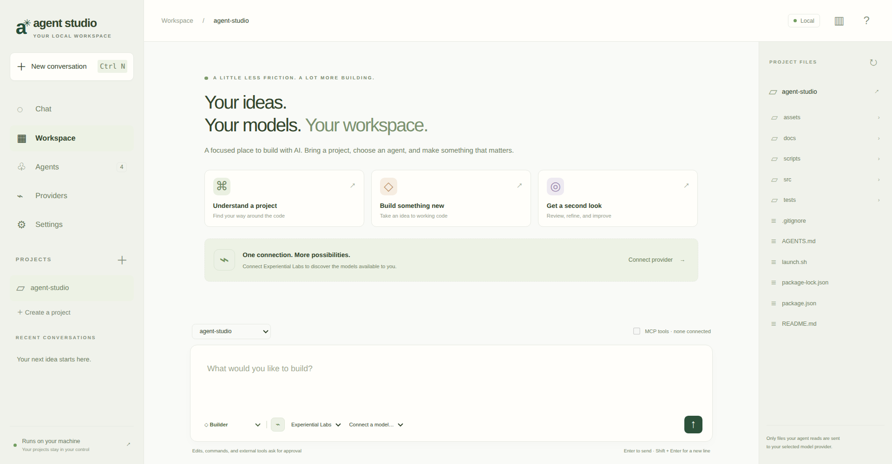
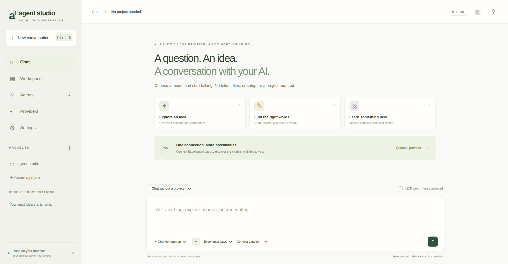
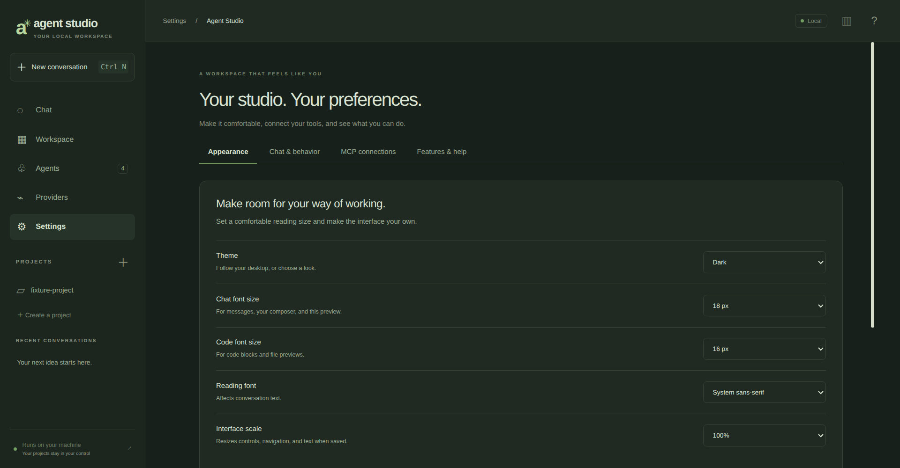

# Agent Studio

A Linux desktop workspace for coding with multiple AI models. Bring an Experiential Labs API key or another OpenAI-compatible server, open a project, and work with custom agents.



## New in 0.2.0

- **Settings:** chat and code font sizes, reading font, interface scale, light/dark/system themes, reduced motion, send shortcut, and startup screen.
- **Standalone chat:** a dedicated Chat entry and conversation context selector, with no project file or shell access.
- **Standalone models:** connect one exact model ID with its own compatible API URL and key, without loading a catalog.
- **Visual model connections:** automatic colored badges, selectable badge styles, and uploaded PNG/JPEG/WebP logos.
- **MCP tools:** connect local stdio or remote Streamable HTTP servers, discover tools, opt in per conversation, and approve every tool call.
- **Features & help:** an in-app overview with shortcuts to each feature.

Existing agents, projects, provider credentials, and conversations are preserved by the version-2 workspace migration. Settings and the Chat companion are added automatically. Restart the application after updating the source.



## Run

Requires Linux x64 (or a matching Electron build), Node.js 22 or newer, npm, and a graphical desktop.

```bash
cd /home/ajeet/Desktop/Project/agent-studio
npm install
npm start
```

Electron downloads its runtime on the first launch if it is not already installed. If your package installation disables lifecycle scripts, this is supported; `node node_modules/electron/install.js` also downloads it explicitly.

A Linux application-menu launcher is installed as **Agent Studio** on this machine. To install it on another checkout, run `npm run install:launcher`.

The packaged build does not require Node.js. Extract the archive in `dist/` and run its `agent-studio` executable. Keep the executable alongside all the other extracted runtime files.

## Connect Experiential Labs

1. Sign in to [Experiential Labs API keys](https://platform.experientiallabs.ai/api-keys?section=keys) and create a key. Keep the full key private.
2. In Agent Studio, open **Providers → Experiential Labs → Connect**.
3. Keep the base URL as `https://api.experientiallabs.ai/v1` and paste the key into **API key**.
4. Click **Save connection**, then **Load models**. This calls `GET /v1/models`; it does not submit a completion.
5. Return to **Workspace**. Select an agent, provider, and model in the composer. Send a small first task to verify inference on your account.

You can alternatively provide `EXPLABS_API_KEY` in the environment of the process launching Agent Studio. For a temporary terminal session without putting the key in shell history:

```bash
read -rs -p 'Experiential API key: ' EXPLABS_API_KEY
export EXPLABS_API_KEY
npm start
unset EXPLABS_API_KEY
```

The application uses Bearer authentication and `POST /v1/chat/completions` with streaming and tool calls. Provider credentials are handled in the main process. They are not returned in renderer state or written to the repository.

Official references: [core API workflow](https://platform.experientiallabs.ai/docs/core-loop), [model catalog](https://platform.experientiallabs.ai/docs/models), [coding agent integrations](https://platform.experientiallabs.ai/docs/coding-agents).

### Free models and usage

Experiential Labs currently advertises free promotions on some models, including [GPT-6 Astra](https://platform.experientiallabs.ai/models/gpt-6-astra) when checked on September 6, 2026. Free promotions, account eligibility, regions, quotas and routing can change. The app does **not** enforce free-only billing and does not label an entire provider as free. Review the selected model's current catalog page and configure any spending limits in your provider account before using it. A model appearing in `/v1/models` does not prove that a completion is free or available in your region.

If a model does not support tools, edit the provider and disable **Enable agent tools** for chat-only requests. You can add a second provider profile pointing at the same base URL if you want separate chat-only and tool-enabled configurations.

## Chat without a project

Click **Chat** in the sidebar. Choose a model and send a message. The app starts here by default; change that under **Settings → Chat & behavior**. Use the selector above the composer to start a new conversation with a project or without one. Changing context starts a new conversation; your previous history stays saved.

Standalone chats have no built-in file, search, or shell tools. External MCP tools remain off until you explicitly enable them for that conversation. An enabled external server may itself access files or services according to its own permissions, and each call is reviewed before execution.

## Connect one standalone model

1. Open **Providers → Add standalone model**.
2. Enter a display name, the exact model ID, the API base URL, and your API key (optional for loopback local servers).
3. Choose an icon style, or upload a PNG/JPEG/WebP logo smaller than 250 KB.
4. Save and click **Chat with model**.

Standalone model connections skip `/models` discovery entirely. They use `/chat/completions` at your configured OpenAI-compatible base URL. They default to chat-only; enable tools under Advanced connection options if the model supports them. Native non-compatible provider APIs are not adapted in this release.

Built-in badges are visual identifiers, not official provider logos. Upload an official logo you are entitled to use if you want exact branding. Images stay local; the app does not fetch external logos while you chat.

## Personalize the app

Open **Settings → Appearance** to preview chat text sizes from 12–22 px, code sizes from 11–20 px, system/serif/monospace reading fonts, and light/dark/system themes. Interface scale ranges from 90–125%. Click **Save preferences** to retain the settings. Interface scale is applied on save; the other appearance changes preview immediately. Reset affects only the open section.

**Chat & behavior** selects the startup screen and Enter versus Ctrl/Command+Enter for sending. **Features & help** explains the capabilities and links to their controls. Preferences are local and survive restarts.



## MCP connections

1. Open **Settings → MCP connections → Add MCP server**.
2. For a **local server**, enter its executable and a JSON array of arguments. The executable/server must already be installed. Keep API credentials in the separate environment-variables JSON field, not in command arguments.
3. For a **remote server**, enter a Streamable HTTP URL and, if needed, its Bearer token. HTTPS is required except on loopback.
4. Save, then click **Connect** and review the executable or endpoint. Saving alone does not launch a server. Local servers run with your Linux user's permissions, from your home directory.
5. Expand **available tools** to inspect the connected tool catalog.
6. In a conversation, choose a tool-enabled model and an agent with approval-based access, then enable **MCP tools** above the composer. Every external call shows the server, tool, and arguments for approval.

Read-only agents never receive MCP tools. Every new conversation starts with MCP off. Connections do not start automatically at app launch. Configurations survive a restart, but you must reconnect intentionally. Server credentials use the existing keyring/session-only vault and are not returned in saved UI state.

The official `@modelcontextprotocol/client` v2 SDK handles stdio and Streamable HTTP with its default legacy-compatible initialization. This release supports tool listing and calls with text/JSON results. It does not implement browser OAuth, legacy HTTP+SSE transport, resource browsing, MCP prompt templates, sampling, or interactive elicitation. For servers requiring those features, use a compatible server configuration or wait for support.

Connections time out after 20 seconds, calls after 60 seconds. A maximum of 64 external tools can be enabled. Disconnect cancels pending connection work; Stop cancels the client request, though a remote server may already have performed an approved action. Server stderr is drained without displaying potentially sensitive logs. Redirects and cross-origin credential forwarding are blocked.

Protocol and SDK references: [MCP local servers](https://modelcontextprotocol.io/docs/develop/connect-local-servers), [official MCP client SDK](https://github.com/modelcontextprotocol/typescript-sdk).

## Add your own agents

1. Open **Agents → Create agent**.
2. Give it a name and a short description.
3. Select **Read only** or **Edit & commands with approval**.
4. Write its instructions and click **Save agent**.
5. Click **Start a conversation** on its card, then choose your model.

Example instructions for a frontend specialist:

```text
You are a frontend engineer. Read the project's existing components and conventions
before proposing changes. Build accessible, responsive interfaces. Keep changes
focused on the requested feature, and validate the result using the project's
available checks. Explain what changed and any remaining limitations.
```

Included agents:

| Agent | Purpose | Access |
| --- | --- | --- |
| Chat companion | General questions, writing and brainstorming | No project tools in standalone chat; optional approved MCP |
| Builder | Implement and validate code changes | Read, propose writes, request commands; optional approved MCP |
| Reviewer | Identify bugs and missing tests | Read only |
| Planner | Understand architecture and plan work | Read only |

Agent definitions live locally in this app. Experiential Labs supplies model inference; creating an agent here does not register a hosted agent in its dashboard. The selected model must support OpenAI-compatible tool calling to use file and command tools.

## Projects and conversations

- **+ next to Projects** opens an existing folder.
- **Create a project** creates a new folder and README.
- The development build includes this source project in its own sidebar on first launch.
- Click a project file to preview it. **Attach to message** explicitly sends that content with your next message.
- Agents can list directories, read text, search files, propose complete file changes, and request shell commands.
- Every agent write presents current and proposed content for review. Every command presents its exact text and working directory before execution.
- **Stop** cancels network activity and terminates an active command's process group.
- Conversations persist across restarts. Use **Export** for Markdown or **Delete** to remove a conversation.
- **Ctrl+N** starts a conversation. Sending defaults to **Enter**, or choose **Ctrl/Command+Enter** in Settings. **Shift+Enter** adds a line.

To add this source folder as a project in the **Codex desktop app**, use Codex's **Add project / Open folder** control and select `/home/ajeet/Desktop/Project/agent-studio`. Agent Studio and Codex maintain separate project lists.

## Other providers

Use **Providers → Add provider** and choose a preset or enter a compatible URL:

- Experiential Labs: `https://api.experientiallabs.ai/v1`
- Ollama: `http://localhost:11434/v1` (start your local server separately)
- LM Studio: `http://localhost:1234/v1` (start its local server separately)
- Custom gateway: its HTTPS OpenAI-compatible `/v1` base URL

Discover models or enter an exact model ID manually. Catalog loading leaves the model selection empty unless you already configured a default; explicitly choose a model before sending. Remote HTTP URLs and redirects are rejected to protect API credentials. Direct native Anthropic/Gemini API protocols are not implemented; use those models through a compatible gateway.

## Storage and execution boundaries

Settings, custom agents, projects and conversation history are stored in Electron's user-data folder (shown on the Providers page; normally `~/.config/Agent Studio`). Override it with `AGENT_STUDIO_DATA_DIR` for an isolated profile.

API keys use Electron `safeStorage` when a secure Linux keyring is available. If the selected backend is `basic_text` or the keyring is unavailable, keys entered in the UI stay in memory for the current session only. Environment variables work across launches when exported by the launcher. Clearing a key removes the stored credential and suppresses it for the current session; remove an exported environment variable too if you do not want it to return next launch.

The renderer has context isolation, sandboxing, no Node integration, a restrictive Content Security Policy, a narrow IPC bridge, no remote content, and denied navigation/popups. Model responses are escaped before display. Tool paths must stay inside the chosen project; symlinks, common credential filenames, `.env` files and dependency/build directories are excluded. Text files are limited to 200 KB and searches are bounded.

Approved shell commands run with **your Linux user's permissions**, not in an OS sandbox. They can reach outside the project and access the network. Inherited variables with common secret-related names are filtered, but this is not comprehensive secret isolation. Commands time out after 60 seconds and have bounded output. Use read-only agents when you want no write or command capability. The file tool path checks are not a defense against another local process deliberately racing filesystem changes.

Source files that an agent reads are sent to the selected model provider as task context. Review the provider's retention policy if that matters for a project. Nothing is sent merely by opening a project.

## Development and packaging

```bash
npm run check          # Syntax validation
npm test               # Unit and local mock-provider integration tests
npm run test:desktop   # Actual Electron UI, isolated profile, local mock gateway
npm run package        # Portable Linux executable directory and .tar.gz
```

Desktop tests require a graphical session. On a headless Linux CI runner with Xvfb installed, use `xvfb-run -a npm run test:desktop`. The test suite uses no real provider keys or paid model calls.

```text
src/main.cjs             Electron lifecycle and validated IPC handlers
src/preload.cjs          Allowlisted renderer API
src/core/provider.cjs    Model discovery and streaming chat adapter
src/core/agent.cjs       Bounded tool-call loop and approval gates
src/core/workspace.cjs   Project file tools and command execution
src/core/store.cjs       Atomic local workspace persistence
src/core/vault.cjs       OS-backed credential encryption / session fallback
src/core/settings.cjs    Validated preferences and defaults
src/core/mcp.cjs         MCP connections, discovery, calls and cleanup
src/renderer/            Desktop interface
scripts/                 Checks, desktop integration and Linux packaging
```

The current release runs one agent task at a time and has a 12-round tool limit. It does not include multi-agent orchestration, terminal emulation, automatic updates, inline editor editing, or Git worktree management. MCP support is limited to the tool connections described above. This is an independent application; it does not embed OpenAI Codex or inherit Codex account access.

## Troubleshooting

- **401:** verify or replace the provider key.
- **402:** inspect your provider balance or allowance.
- **403:** inspect model permissions and supported region.
- **429:** wait for the provider's rate limit to reset.
- **No models:** verify the base URL and key; use an exact manual model ID if the server has no model-list endpoint.
- **Unsupported tools:** disable tools for that provider profile, or select a model that supports them.
- **MCP executable not found:** use Browse to select an installed executable, or add its absolute path; desktop launchers may have a different PATH from your terminal.
- **MCP unauthorized:** check the Bearer token; browser OAuth is not supported.
- **MCP disabled in chat:** connect a server with tools, enable tools for the model connection, and use an approval-based agent.
- **Context too long:** start a fresh conversation; automatic context compaction is not implemented.
- **Linux sandbox error:** enable the distribution's supported Chromium/Electron user-namespace or sandbox configuration. The launcher deliberately does not disable Chromium's sandbox.
